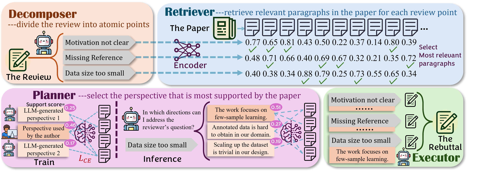
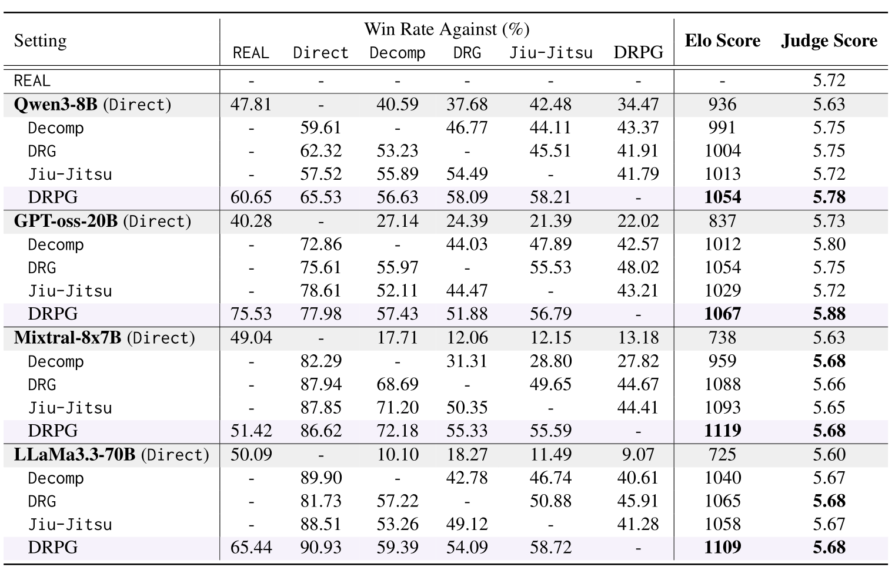

<div align="center">
<h1>
DRPG (Decompose, Retrieve, Plan, Generate): An Agentic Framework for Academic Rebuttal
</h1>
</div>

<div align="center">
<h3>
Peixuan Han, Yingjie Yu, Jingjun Xu, Jiaxuan You
</h3>
</div>


<p align="center">
📃<a href="https://arxiv.org/pdf/2601.18081" target="_blank">Paper</a> • 🤗<a href="https://huggingface.co/collections/HakHan/drpg-rebuttalagent" target="_blank">Model & Data</a>
</p>


# About



**DRPG** is one of the earliest agentic frameworks for automatic academic rebuttal generation. DRPG consists of four components: Decomposer, Retriever, Planner, and Executor. It first decompose reviews into atomic concerns, retrieve relevant evidence from the paper, plan rebuttal strategies, and generate responses accordingly. These modules let DRPG overcome long-context and rebuttal quality challenges of single-LLM pipelines. Experiments on data from top-tier conferences demonstrate that DRPG significantly outperforms existing rebuttal pipelines and achieves performance beyond the average human level using only an 8B model.

# Usage

To begin with, create a conda environment with `Python 3.10` and run `pip install -r requirements.txt` to install necessary packages.

## Data Preperation

Firstly, download the raw data from [here](https://huggingface.co/datasets/HakHan/DRPG_Dataset) and put it in the `/data` directory. The directory should look like:
```
data/
├── rebuttal/
|   ├── train_real.json (contains rebuttal from human authors)
│   └── test_real.json
├── revised_score/
│   ├── train_real_real.json (contains discussion between human authors and reviewers, and the final score)
│   └── test_real_real.json
├── perspective/
│   └── llama-3.3-70b-instruct/
|       ├── train.json (contains perspectives used in planner training)
|       └── test.json
├── processed_papers.json (contains paper information)
├── train.json (contains review information)
└── test.json
```

`src/data_process` contains data processing scripts. These scripts are not required for reproducing this work, but may be useful if you wish to apply DRPG to your own datasets. Please refer to the comments at the top of each script for details.

## Run the Pipeline

Use `scripts/train_planner.sh` to train the planner. You can also download the trained version from [here](https://huggingface.co/HakHan/DRPG_Planner).

Use `scripts/all_rebuttal.sh` to run rebuttal with DRPG and its baselines.

Use `scripts/run_DRPG.sh` to run rebuttal with DRPG alone. You can refer to `run_rebuttal_clean.py` for a "clean" implementation of DRPG. 

## Evaluation

Use `scripts/all_judge_model.sh` to apply the judge model (download from [here](https://huggingface.co/HakHan/DRPG_JudgeModel)) to give a score to rebuttals.

Use `scripts/all_compare.sh` to do pairwise comparison between different rebuttals (and use `src/elo.py` to calculate elo score).



## Cite this paper
If you find this repo or the paper useful, please cite:
```
@article{han2025drpg,
  title={DRPG (Decompose, Retrieve, Plan, Generate): An Agentic Framework for
Academic Rebuttal},
  author={Han, Peixuan and Yu, Yingjie and Xu, Jingjun and You, Jiaxuan},
  journal={arXiv preprint arXiv:2601.18081},
  url={https://arxiv.org/pdf/2601.18081},
  year={2026}
}
```

Reach out to [Peixuan Han](mailto:ph16@illinois.edu) for any questions.
